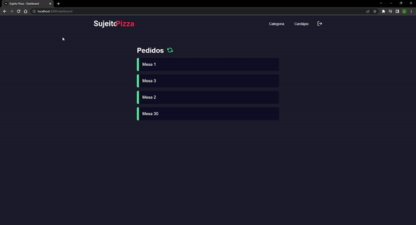

# Pizzaria

# Sobre o projeto

 Este projeto é um sistema de uma pizzaria que consome uma api própria: <https://github.com/leowingss/backend-pizzaria>.

 Conseguimos controlar os pedidos de cada mesa, também temos a opção de cadastrar uma categoria e cadastrar um produto.

 O projeto tem sistema de login e cadastro.

 O intuito é treinar meus conhecimentos em React e Next com a ajuda do dev Matheus Fraga do canal: 

 <https://www.youtube.com/c/Sujeitoprogramador>


## Layout Web 

<div style="display: flex; flex-wrap: wrap;">


</div>


# Tecnologias utilizadas 

- Next.Js, React.Js
- TypeScript
- Sass

# Pré requisitos

 - Node.js e sistema backend rodando: 

```bash
 # Baixar backend
 git clone https://github.com/leowingss/backend-pizzaria.git

 # Instalar dependências e executar o projeto
 yarn install 
 yarn dev
```


# Como rodar o projeto

```bash 
git clone https://github.com/leowingss/sistema-web-pizzaria.git

# Entrar na pasta
cd sistema-web-pizzaria

# Instalar dependências
yarn install ou npm install

# Executar o projeto
yarn dev ou npm run dev

# Abrir projeto

Entrar no http://localhost:3000

``` 
